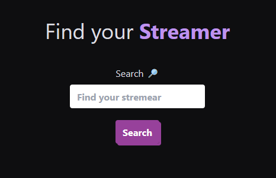
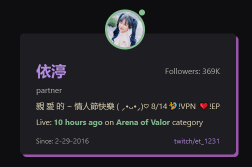

# Twitch Finder

[](https://GitHub.com/Naereen/badges/graphs/contributors/)

## Technologies

[](https://www.javascript.com/)[](https://typescriptlang.org)[](https://https://npmjs.com/)

```
git clone https://github.com/valenne/twitch-finder.git
```

## Astro Website


## Description

Twitch Finder is the easiest way to discover new Twitch channels. Simply enter a streamer name, or keyword, and we'll show you a information about your searching.

## What you need?

You need to get access to the twitch API, then saved the variables on the .env file, like this example:

.env ⬇

```
PUBLIC_TWITCH_CLIENT_ID={here put your id client}
PUBLIC_TWITCH_CLIENT_SECRET={here put your secret client }

```

## 🚀 Project Structure

Inside of your Astro project, you'll see the following folders and files:

```
/
├── public/
│   └── twitch.svg
├── src/
│   ├── assets/
│   │    └── images/
│   ├── components/
│   │   ├── icons/
│   │   ├──section-content/
│   │   │  └──ContentCard.tsx
│   │   │  └──ContentSection.tsx
│   │   ├──section-hero/
│   │   │  └──intro_draw_parth.css
│   │   │  └──Intro.astro
│   │   ├──section-nav/
│   │   │  └──Nav.tsx
│   │   │  └──TittleAnimation.tsx
│   │   ├──section-streamer/
│   │   │  └──CardStreamer.tsx
│   │   │  └──TwitchStreamer.tsx
│   ├── config/
│   │   └── config.ts
│   └── data/
│   │   └── twitchAuth.ts
│   └── helper/
│   │   └── helpersExporter.ts
│   │   └── helpers.ts
│   │   └── returnFixedUrlTwitchGame.ts
│   │   └── returnNewEmoteData.ts
│   ├── hooks/
│   │   └── hookExporter.ts
│   │   └── useMediaQuery.ts
│   │   └── useTwitchApiData.ts
│   │   └── useTwitchHooks.ts
│   ├── layouts/
│   │   └── MainLayout.astro
│   └── pages/
│       └── index.astro
│       └── streamer.astro
│   └── types/
│       └── typesExporter.ts
│       └── constants.ts
│       └── types.d.ts
│       └── types_twitch.d.ts
│   └── utils/
│       └── animatedNumbers.ts
│       └── drawingStroke.ts
└── package.json
```

Astro looks for `.astro` or `.md` files in the `src/pages/` directory. Each page is exposed as a route based on its file name.

There's nothing special about `src/components/`, but that's where we like to put any Astro/React/Vue/Svelte/Preact components.

Any static assets, like images, can be placed in the `public/` directory.

## 🧞 Commands

All commands are run from the root of the project, from a terminal:

| Command                   | Action                                           |
| :------------------------ | :----------------------------------------------- |
| `npm install`             | Installs dependencies                            |
| `npm run dev`             | Starts local dev server at `localhost:3000`      |
| `npm run build`           | Build your production site to `./dist/`          |
| `npm run preview`         | Preview your build locally, before deploying     |
| `npm run astro ...`       | Run CLI commands like `astro add`, `astro check` |
| `npm run astro -- --help` | Get help using the Astro CLI                     |

## Images




on click card, show you in a new page, information about the streamer, like:

- Channel Description
- Main Languages
- Favorite Game
- Last Title Stream
- Followers
- Channel Emotes
- Channel Badges
- etc
